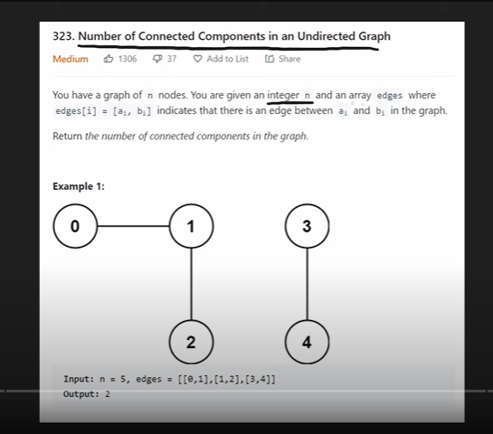

### Google Interview Question
* [Question - premium](https://leetcode.com/problems/number-of-connected-components-in-an-undirected-graph/)
* [Neetcode](https://www.youtube.com/watch?v=8f1XPm4WOUc)

* [Question - free-version(not same)](https://leetcode.com/problems/number-of-provinces)

### Question
* 

###
* we gonna use union-find algorithm to solve this.